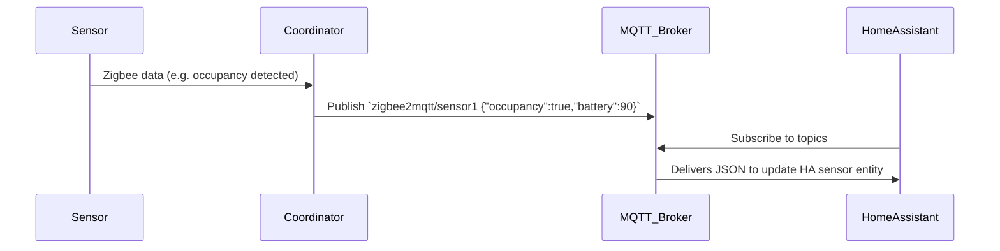

# Raspberry Pi Zigbee DIY with IKEA Sensors – Executive Summary

Building a DIY Zigbee home automation hub on a Raspberry Pi lets you directly integrate IKEA TRÅDFRI sensors without a proprietary gateway. Modern Raspberry Pis (e.g. Pi 4 or Pi 3B+; Pi Zero W is also possible) running a Linux OS (Raspberry Pi OS, Ubuntu, or Home Assistant OS) serve as capable controllers【53†L153-L160】. You then attach a Zigbee coordinator (USB stick or HAT) flashed with suitable firmware (e.g. TI Z‑Stack for CC26xx or EmberZNet for Silicon Labs devices) and run gateway software such as **Zigbee2MQTT**, **Home Assistant ZHA**, or **deCONZ**. Each has trade-offs: Zigbee2MQTT has a huge device database and MQTT integration, ZHA is built into Home Assistant, and deCONZ (with a ConBee stick) offers its own GUI. We summarize compatible hardware and firmware in tables below. 

Next, we list common IKEA Zigbee sensors and the data they provide (motion, contact, temperature/humidity, etc.), including their Zigbee cluster usage and example MQTT payloads. Step-by-step instructions cover flashing coordinator firmware (e.g. flashing a CC2531), installing/configuring the gateway software, pairing sensors (typically by pressing the onboard pairing button 4×【71†L119-L124】【45†L126-L130】), and checking that data arrives (e.g. via Mosquitto logs or Home Assistant entities). We include example commands (like publishing `{"battery":""}` to a Zigbee2MQTT topic to query battery level【36†L207-L214】) and sample MQTT JSON. Finally, we cover troubleshooting (range, interference, device limits) and security best practices (changing Zigbee network keys, securing MQTT). Throughout, official sources (Zigbee2MQTT docs, Home Assistant docs, IKEA) are cited, and diagrams illustrate the Zigbee/RPi network and data flow.

## 1. Hardware & Software Components

**Raspberry Pi:** Any recent model can be used. A Raspberry Pi 4B is recommended for performance and multiple USB ports【53†L153-L160】, but Pi 3B+/Zero W also work. The controller can run standard Linux (e.g. Raspberry Pi OS, Debian/Ubuntu) or Home Assistant OS. Zigbee software (Zigbee2MQTT, Home Assistant, deCONZ) runs on most Linux environments.

**Zigbee Coordinator:** This is the radio adapter that plugs into the Pi. Popular options include:

- **TI CC2531 USB** (cheap, ~20 USD): Requires flashing Z-Stack (ZNP) coordinator firmware【26†L148-L157】. Limited performance (≈20–30 devices)【62†L118-L125】. Very low cost, but *not recommended* for large networks【62†L118-L125】.
- **TI CC2652-based sticks** (e.g. Sonoff ZBDongle-P, CC2652R/P sticks): Modern Zigbee 3.0 chips with good range and capacity. Often come pre-flashed with Z-Stack 3.x firmware. Supports 100+ devices and higher TX power (CC2652P has +20dBm PA)【17†L152-L156】【31†L277-L286】. Flashing is done via TI Flash Programmer or vendor tools【31†L277-L286】.
- **Silicon Labs EZSP sticks** (e.g. Sonoff ZBDongle-E (EFR32MG21), Elelabs Zigbee USB): Use EmberZNet (EZSP) protocol. Sold pre-flashed. Well-supported by Home Assistant ZHA【20†L146-L154】. Good range and capacity similar to CC26xx.
- **Dresden Elektronik ConBee 3**: USB stick with deCONZ stack. Excellent compatibility (especially Zigbee 3.0). Mains-powered routers (any smart bulb/outlet) extend range. Integrates via deCONZ software or ZHA (via `zigpy-deconz`)【20†L161-L164】.
- **Nortek HUSBZB-1**: Combo Z-Wave/Zigbee stick. Outdated, limited device support in ZHA, not recommended for new builds.
- **RaspBee HAT**: Raspberry Pi HAT version of ConBee (fits Pi’s GPIO). Similar capabilities to ConBee.
- **Mesh Routers:** Mains-powered Zigbee devices (smart plugs, bulbs) are strongly recommended as routers to extend range and capacity【20†L131-L134】.

The table below compares key adapters:

| Adapter / HAT        | Chipset        | Protocol/Firmware      | Max Devices (approx.) | Range/Pros                  | Cons                           |
|----------------------|----------------|------------------------|-----------------------|-----------------------------|--------------------------------|
| TI CC2531 USB        | CC2531 (802.15.4) | Z-Stack 1.x (flashed)   | ~30–40                | Very low cost (~$5–10), USB | Limited range & device count【62†L118-L125】 |
| CC2652R/P USB stick (e.g. Sonoff ZBDongle-P) | CC2652R/P (Zigbee 3.0) | Z-Stack 3.x (flashed)  | 100+ (w/ routers)      | Long range (+PA), high capacity【17†L152-L156】 | More expensive, needs flash (if not pre-loaded) |
| Silicon Labs EZSP USB (e.g. Sonoff ZBDongle-E) | EFR32MG21 (Zigbee 3.0) | EmberZNet/EZSP         | 100+                  | Good range, HA EZSP support【20†L146-L154】    | Usually pre-flashed; requires Bellows for ZHA  |
| ConBee 3 USB         | nRF52840 (Zigbee 3.0) | deCONZ stack            | ~100+                 | Excellent device support, GUI (Phoscon) | Higher cost (~$30–40)         |
| RaspBee HAT          | (same as ConBee)   | deCONZ stack            | ~100+                 | Compact HAT form-factor     | Occupies Pi GPIO, no USB backup |
| HUSBZB-1 (Nortek)    | (Z-Wave+ & TI CC2531) | Z-Stack (for Zigbee)   | ~30                   | Dual-protocol stick         | Limited Zigbee, outdated support |

*Sources:* Zigbee2MQTT and Home Assistant docs list recommended adapters and note that TI CC2531/CC2530 are weak performers【62†L118-L125】【20†L146-L154】. Home Assistant’s ZHA docs specifically endorse EmberZNet sticks (e.g. Sonoff ZBDongle) and TI CC2652 with Z‑Stack【20†L146-L154】【17†L152-L156】.

**Software Stacks:** 

- **Zigbee2MQTT:** A Node.js gateway that uses zigpy/zigbee-herdsman internally. Requires a local MQTT broker (Mosquitto recommended【23†L160-L165】). Broad device support (huge community database) and highly configurable. Runs on Linux, Docker, or as a Home Assistant add‑on. Exposes devices via MQTT topics.
- **Home Assistant ZHA:** Built-in HA integration using the zigpy library. No extra broker needed. Easy setup via the HA UI (just select the serial port and radio type). Good device coverage and automatically creates HA entities. Depends on which radio (EZSP, ZNP, deCONZ) is used.
- **deCONZ / Phoscon:** Vendor gateway (RPi software) for ConBee/RaspBee. Offers a web UI (Phoscon app) for pairing and viewing devices. Integrates into HA via the deCONZ add-on or ZHA (zigpy-deconz). Good stability for devices supported by ConBee.

A comparison of integration choices:

| Integration/Stack     | Hardware       | Key Features                              | Pros                                             | Cons                                     |
|-----------------------|----------------|-------------------------------------------|--------------------------------------------------|------------------------------------------|
| Zigbee2MQTT           | Any flashed coordinator (TI/Silabs) | MQTT-based, large device DB | Very broad device support, MQTT interface, runs on any Linux【23†L160-L165】 | Requires separate MQTT broker, extra config, learning curve  |
| Home Assistant ZHA    | Any zigpy-supported (CC2652, Sonoff, ConBee, etc) | Native HA integration | Easy HA integration, no extra broker, auto entity config【20†L146-L154】 | Slightly smaller device DB, relies on HA update cycle    |
| deCONZ (Phoscon)      | ConBee/RaspBee (Dresden) | GUI pairing app, REST API | Robust ConBee firmware, good 3.0 support【20†L161-L164】 | Limited to ConBee hardware, separate service to run    |

*Notes:* Zigbee2MQTT has a powerful frontend and MQTT topics/messages【23†L184-L193】. ZHA is simpler for HA users (just add integration in UI). deCONZ is stable but hardware-locked. See respective docs for setup details.

## 2. IKEA Zigbee Sensors and Data Formats

IKEA’s smart home line (TRÅDFRI/Dirigera) uses Zigbee for sensors. Common models include motion, contact, and environmental sensors. The table below lists key models and their data clusters/payloads:

| Model (IKEA)             | Function            | Data Exposed (Zigbee Clusters)                                                                                                         |
|--------------------------|---------------------|--------------------------------------------------------------------------------------------------------------------------------------|
| **E1525/E1745**          | TRÅDFRI Motion Sensor    | *Occupancy* (binary motion) and *Illuminance* (lux threshold) via Zigbee Occupancy and Illuminance Measurement clusters; *Battery* level (PowerCfg cluster)【71†L108-L111】. Reports `occupancy=true/false`, `illuminance`, `battery%`. |
| **E2134 (VALLHORN)**     | Wireless Motion Sensor   | Similar to above: *Occupancy* and *Illuminance*, plus `battery` and `voltage`【35†L106-L110】. Publishes JSON like `{"occupancy":true,"illuminance":120,"battery":85}`. |
| **E2013 (PARASOLL)**     | Door/Window (Contact) Sensor | *Contact* (open/closed) through Zigbee IAS Zone or GenOnOff cluster; also `battery`, `voltage`【45†L108-L110】. Payload example: `{"contact":false,"battery":95}` (`false` = closed)【45†L146-L150】. |
| **E2112 (VINDSTYRKA)**   | Air Quality Sensor (temp/humidity) | *Temperature*, *Humidity*, *PM2.5* and *VOC index*【47†L108-L110】. Reports e.g. `{"temperature":25,"humidity":40,"pm25":12,"voc_index":50}`. |
| **(Others)**            | (e.g. E2000 VINDRIKTNING temp/humidity) | IKEA also offers a Temperature/Humidity sensor (Vindriktning) and water-leak sensors; these use standard Zigbee measurement clusters. (Not shown above.) |

Each sensor reports data over Zigbee as attributes. For example, the motion sensor’s occupancy state appears in MQTT on its topic (`zigbee2mqtt/<name>`) as `"occupancy":true/false`【36†L184-L190】. The contact sensor’s state is the `contact` field (note: Zigbee2MQTT flips true/false logic: false means closed)【45†L146-L150】. Battery status is exposed on the `battery` (0–100%) and `voltage` fields【36†L207-L214】【45†L161-L168】.

*(Clusters: typical Zigbee clusters are used. E.g., the TRÅDFRI motion and light sensors use the Illuminance (0x0400) and Occupancy (0x0406) clusters. The contact sensor uses the IAS Zone or OnOff (0x0006) cluster. Battery uses Power Configuration (0x0001).)*

## 3. Setup Steps

### 3.1 Flashing Coordinator Firmware

If your adapter isn’t pre-flashed, load coordinator firmware before use. For example, flashing a TI CC2531 USB stick requires the TI **SmartRF Flash Programmer 2** (Windows) or an alternative method【26†L148-L157】. Zigbee2MQTT’s docs provide step-by-step guides. Briefly, using a CC Debugger or Arduino/ESP board, you program the CC2531 with the Z-Stack firmware binary:

```
# Example (on Windows with TI Flash Programmer):
1. Connect CC Debugger to PC and CC2531.
2. In Flash Programmer, select CC2531 target.
3. Load the hex file (Z-Stack coordinator).
4. Press "Erase", then "Program".
```

For CC2652 sticks, vendors often supply flashing instructions or web tools. For instance, the Sonoff ZB Dongle Plus has a web flasher【31†L287-L292】. In Home Assistant ZHA mode, CC2652 sticks only need firmware if switching between Zigbee2MQTT/HA. In summary, ensure the USB adapter is flashed as a Zigbee coordinator (Z-Stack for TI chips, EmberZNet for Silabs) as per your adapter’s instructions【26†L148-L157】【31†L287-L292】.

### 3.2 Installing Software on Raspberry Pi

Choose a gateway software. Here we outline **Zigbee2MQTT** installation on Raspberry Pi OS; Home Assistant and deCONZ installations are similar or available as add-ons.

**Zigbee2MQTT** on Linux:
Install Node.js and dependencies, clone the zigbee2mqtt repo, and run it:

```bash
# (On Raspberry Pi OS / Debian)
sudo apt-get update
sudo apt-get install -y curl git make g++ gcc libsystemd-dev
sudo curl -fsSL https://deb.nodesource.com/setup_lts.x | sudo -E bash -
sudo apt-get install -y nodejs
sudo corepack enable

sudo mkdir /opt/zigbee2mqtt
sudo chown -R $USER: /opt/zigbee2mqtt
cd /opt/zigbee2mqtt
git clone --depth 1 https://github.com/Koenkk/zigbee2mqtt.git .
pnpm install --frozen-lockfile   # Install dependencies
```

*(Alternatively, use Docker or the Home Assistant Zigbee2MQTT add-on if running HA OS.)*

After installing, start Zigbee2MQTT:
```bash
cd /opt/zigbee2mqtt
pnpm start
```
On first run, it launches a web onboarding at `http://<PiIP>:8080`【54†L216-L225】 to configure the adapter path and MQTT broker. The logs will show a message like:
```
Zigbee2MQTT:info  ... Successfully interviewed '0x00158d0001dc126a', device has been paired
```
indicating a device was paired【23†L248-L254】.

**Home Assistant (ZHA):** Install Home Assistant (OS or Core) on the Pi. In the HA UI, go to *Settings → Devices & Services → Add Integration*, and choose “ZHA”. Select your adapter type (e.g. EZSP, Z-Stack, deCONZ) and the `/dev/ttyUSB*` port. HA will then scan for Zigbee devices.

**deCONZ (ConBee):** Install the deCONZ REST API (e.g. via the Dresden IoT home assistant add-on or Linux package). Use the Phoscon web app (usually at `https://<PiIP>:8443`) to pair devices.

### 3.3 Pairing IKEA Sensors

Once the coordinator is running and “permit join” is enabled, pair each IKEA sensor:

- **Enable Joining:** In Zigbee2MQTT, set `permit_join: true` in `configuration.yaml` or click *“Permit join”* in the frontend. In Home Assistant ZHA, pressing the “join” button in the integration UI permits new devices.
- **Activate Sensor Pairing:** Most IKEA sensors have a tiny button. Press it **4 times quickly** (sometimes 10s press for ZLL mode) to enter pairing mode【71†L119-L124】【45†L126-L130】. The sensor’s LED will blink and the coordinator should log that it was added.

Example (Zigbee2MQTT pairing):
```bash
# (In zigbee2mqtt configuration.yaml)
permit_join: true
```
Then tap the sensor’s pairing button. The Zigbee2MQTT log shows “Successfully interviewed …, device has been paired” when complete【23†L248-L254】.

### 3.4 Configuring and Verifying Data

**Device Naming:** After pairing, Zigbee2MQTT names the device by its IEEE address. Optionally assign a friendly name in `data/configuration.yaml`:
```yaml
devices:
  '0x00158d0001dc126a':
    friendly_name: kitchen_motion
```
or use the MQTT frontend.

**MQTT Integration:** Zigbee2MQTT publishes each sensor’s state to `zigbee2mqtt/<friendly_name>` (JSON). For example, a motion sensor might publish:
```json
zigbee2mqtt/kitchen_motion {"occupancy": true, "illuminance": 150, "battery": 82, "voltage": 3000}
```
To request values, publish to `zigbee2mqtt/<name>/get`. E.g., to query battery:
```bash
mosquitto_pub -h localhost -t zigbee2mqtt/kitchen_motion/get -m '{"battery":""}'
```
The sensor will respond on `zigbee2mqtt/kitchen_motion` with something like `{"battery":82}`【36†L207-L214】.

**Home Assistant (MQTT):** Add the MQTT integration (if not already). HA will auto-discover Zigbee2MQTT devices if enabled, or you can manually configure MQTT sensors. In ZHA, no MQTT is needed; devices become HA entities automatically.

**Verifying in Home Assistant:** Check *Developer Tools → MQTT* or HA’s *States* tab. For Zigbee2MQTT, use `mosquitto_sub -v 'zigbee2mqtt/#'` to watch all messages. You should see JSON messages when sensors update. In ZHA, sensors appear as entities (e.g. `binary_sensor.kitchen_motion` for motion, `sensor.front_door_contact` for contact).

## 4. Troubleshooting & Best Practices

- **USB Adapter Placement:** Use a short USB extension cable for the Zigbee stick【62†L129-L137】. This keeps it away from the Pi’s metal and USB3 interference, greatly improving range. (Plugging directly into a Pi USB3 port can severely limit signal【62†L129-L137】.) Try different orientations for the stick’s antenna; sometimes rotating the adapter improves link quality【62†L146-L154】.
- **Channel & Interference:** Zigbee and Wi-Fi share 2.4 GHz. Avoid Wi-Fi channels (1,6,11) by setting the Zigbee channel (11–26). For example, channel 15 or 20 often has less overlap【62†L158-L167】. If interference persists, move the Pi/adapter away from routers or other 2.4 GHz devices (Bluetooth dongles, cordless phones, etc.).
- **Network Routers:** Battery sensors only talk to the coordinator or nearest mains-powered router. Ensure you have some always-on Zigbee mains outlets or bulbs acting as routers to strengthen the mesh. (ZHA docs note that a robust network requires multiple router devices【20†L131-L134】.) For example, each smart plug can relay messages for nearby sensors.
- **Device Limits:** Older sticks (CC2531, ConBee I) can only handle ~20–30 direct children【62†L118-L125】. Modern sticks (CC2652, ConBee 3) support 100+ devices with proper routers. If many devices drop out, consider adding more routers or upgrading the coordinator. (Replace a CC2531 with a CC2652 adapter if needed.)
- **Sensor Issues:** Some IKEA sensors (e.g. PARASOLL door sensor) are known to be finicky on non-IKEA networks【45†L112-L120】. Ensure they have good signal and fresh batteries. Try re-pairing if a sensor goes offline.

### Security

- **Zigbee Encryption Key:** Zigbee uses a network encryption key. Zigbee2MQTT v1.33+ generates a random key by default. For older versions, you should *change the default key* in `configuration.yaml` to a unique 128-bit value【63†L119-L127】. All devices must be re-paired after key change. This prevents eavesdropping if the default key is known.
- **MQTT Security:** Use a secured MQTT broker. At minimum, set a strong username/password and restrict broker access to your LAN. For better security, enable TLS on Mosquitto. Since IKEA sensors only publish via coordinator, the main risk is Wi-Fi compromise; ensure your Pi’s network is secure.
- **System Hardening:** Keep your Pi updated. Disable unused services/ports. If exposing Home Assistant remotely, use HTTPS, strong authentication, and never expose your Zigbee coordinator directly to untrusted networks.

### Performance Considerations

- **Range:** Zigbee range is typically 10–20 meters indoors. Walls and metal objects reduce range. Use routers to extend coverage and place the coordinator centrally.
- **Channel Selection:** As above, pick a Zigbee channel away from heavy Wi-Fi channels【62†L158-L167】. If adding many Wi-Fi devices, adjust accordingly.
- **Mesh Routing:** Battery devices sleep and only send occasionally. Routers (mains devices) must be within range of the coordinator. The more routers you have, the more traffic capacity and coverage. ZHA docs emphasize that Zigbee networks “depend heavily” on multiple router devices【20†L131-L134】. Without enough routers, devices may lose connection.
- **Logs & Diagnostics:** Use logs to debug. Zigbee2MQTT’s log will note “interview” failures if a device doesn’t respond. In HA ZHA, enable debug logging for `zigpy` if a device behaves oddly. Monitor RSSI or link_quality in logs to see signal strength.

```mermaid
flowchart LR
    A[Raspberry Pi Controller] --> B[Zigbee Coordinator (USB)]
    B --> C[Motion Sensor (IKEA)]
    B --> D[Door Sensor (IKEA)]
    B --> E[Air Quality Sensor (IKEA)]
    B -.-> F[Zigbee Router<br/>(Smart Bulb/Plug)]
    F --> C
    F --> D
    F --> E
    B --> G[MQTT Broker]
    G --> H[Home Assistant]
```



### Summary of Key Commands/Config

- **Zigbee2MQTT config snippet (`configuration.yaml`):**
  ```yaml
  mqtt:
    base_topic: zigbee2mqtt
    server: 'mqtt://localhost'
  serial:
    port: /dev/ttyUSB0
  advanced:
    pan_id: 0x1A62
    channel: 15
    network_key: GENERATE    # let Z2M make a random key
  devices:
    '0x00158d0001dc126a':
      friendly_name: kitchen_motion
  ```
- **Starting Zigbee2MQTT (daemon):** See [54†L247-L257] for a systemd service file example.
- **Pairing sensor:** (as described) Press sensor button 4×. In Zigbee2MQTT, ensure `permit_join: true` (or use web UI *Permit Join* button).
- **Query sensor (MQTT):** e.g., `mosquitto_pub -t zigbee2mqtt/living_room_motion/get -m '{"battery":""}'`【36†L207-L214】.
- **Monitoring MQTT:** `mosquitto_sub -v -t 'zigbee2mqtt/#'`.
- **Home Assistant (MQTT):** Configure MQTT integration, or use ZHA integration directly for entities.

<span style="font-size:smaller;">*Sources:* Official IKEA product pages and press releases; Zigbee2MQTT documentation (adapter list【17†L152-L156】, device guides【71†L108-L111】【45†L108-L110】【47†L108-L110】, installation guide【54†L183-L191】); Home Assistant ZHA docs【20†L146-L154】【20†L157-L164】【20†L131-L134】; and Zigbee2MQTT advanced docs【62†L118-L125】【63†L119-L127】.</span>